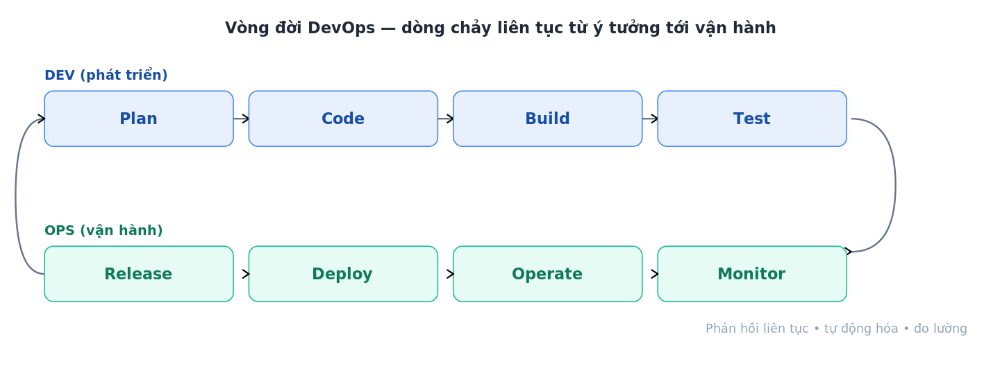
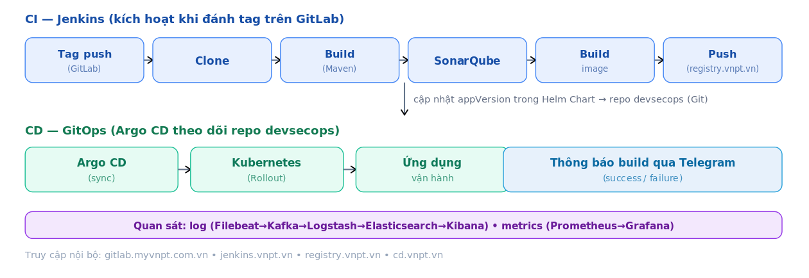
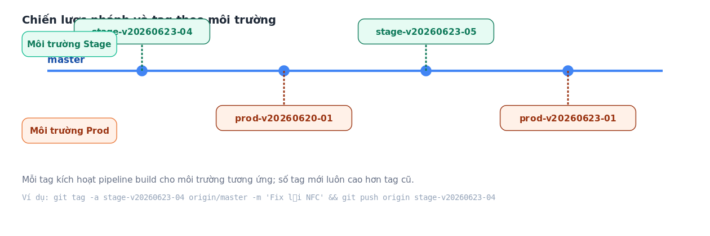
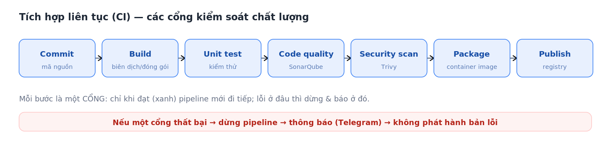
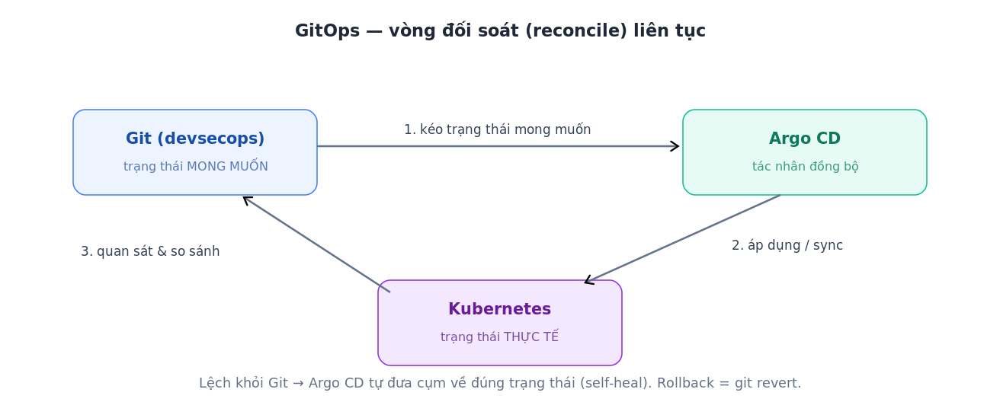
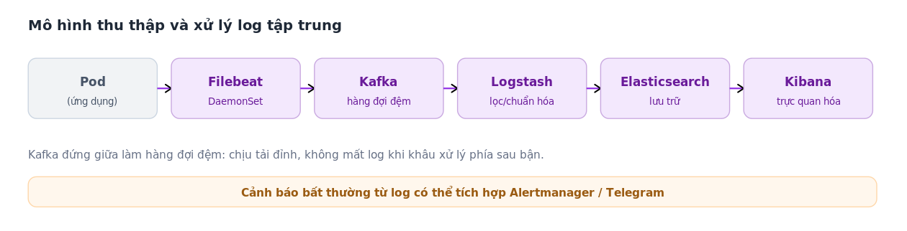
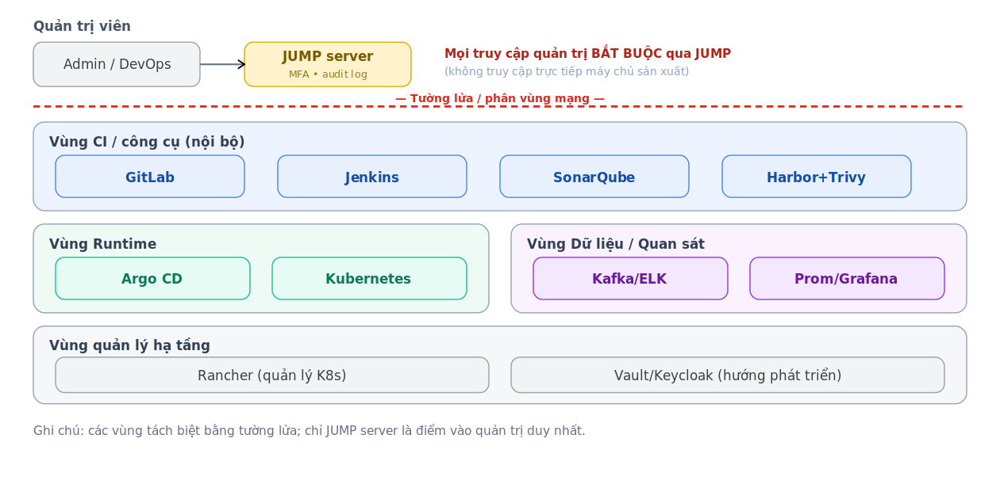
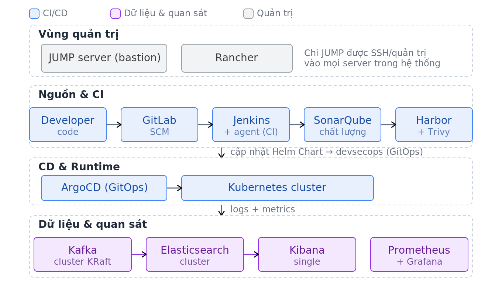
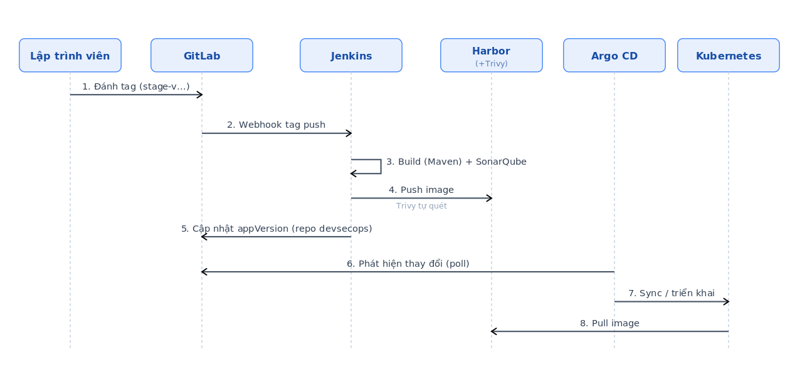

# Toàn trình CI/CD chuẩn production — Hiểu từ A đến Z

> Bài viết giải thích **toàn bộ hành trình CI/CD**: gồm những phần nào, mỗi phần làm gì, cần triển khai những gì để đạt chuẩn production, kèm **mô hình và workflow từng phần** để dễ hình dung. Các sơ đồ minh họa theo một hệ thống thực tế (GitLab, Jenkins, SonarQube, Harbor/Trivy, Argo CD, Kubernetes, ELK, Prometheus/Grafana).

## Mục lục
1. [CI/CD là gì và vì sao cần](#1-cicd-là-gì-và-vì-sao-cần)
2. [Bức tranh tổng thể: vòng đời DevOps](#2-bức-tranh-tổng-thể-vòng-đời-devops)
3. [Toàn trình CI/CD gồm những phần nào](#3-toàn-trình-cicd-gồm-những-phần-nào)
4. [Giải thích từng phần kèm workflow](#4-giải-thích-từng-phần-kèm-workflow)
5. [Mô hình kiến trúc tổng thể chuẩn production](#5-mô-hình-kiến-trúc-tổng-thể-chuẩn-production)
6. [Workflow end-to-end một lần phát hành](#6-workflow-end-to-end-một-lần-phát-hành)
7. [Cần triển khai những gì cho production](#7-cần-triển-khai-những-gì-cho-production)
8. [Đo lường hiệu quả: nhóm chỉ số DORA](#8-đo-lường-hiệu-quả-nhóm-chỉ-số-dora)
9. [Lộ trình áp dụng & tổng kết](#9-lộ-trình-áp-dụng--tổng-kết)

---

## 1. CI/CD là gì và vì sao cần

**CI/CD** là cách tự động hóa con đường đưa một thay đổi mã nguồn từ máy lập trình viên ra tới môi trường vận hành (production) một cách **nhanh, an toàn và lặp lại được**.

- **CI — Continuous Integration (Tích hợp liên tục):** mỗi thay đổi mã nguồn được **tự động build, kiểm thử, kiểm tra chất lượng và bảo mật**. Mục tiêu: phát hiện lỗi *sớm*, ngay khi vừa viết, thay vì để dồn đến lúc phát hành.
- **CD — Continuous Delivery/Deployment (Chuyển giao/Triển khai liên tục):** bản đã qua kiểm thử được **tự động đóng gói và đưa ra môi trường vận hành** theo một quy trình chuẩn, có kiểm soát, có thể quay lui.

Vì sao cần? Quy trình thủ công (lập trình viên đẩy code, người vận hành đăng nhập từng máy chủ kéo về chạy tay) có các vấn đề kinh điển: **chậm, dễ sai, khó quay lui, khó truy vết, thiếu kiểm soát chất lượng và bảo mật**. CI/CD giải quyết tất cả những điều đó bằng tự động hóa và chuẩn hóa.

---

## 2. Bức tranh tổng thể: vòng đời DevOps

CI/CD là phần "xương sống kỹ thuật" nằm trong một vòng lặp lớn hơn gọi là **vòng đời DevOps** — dòng chảy liên tục từ ý tưởng tới vận hành rồi quay lại cải tiến:

Phía **Dev** lo *Plan → Code → Build → Test*; phía **Ops** lo *Release → Deploy → Operate → Monitor*. Điều cốt lõi: **phản hồi liên tục** — dữ liệu vận hành (log, metrics, sự cố) quay lại định hướng cho lần phát triển tiếp theo. CI/CD chính là cơ chế giúp vòng lặp này quay **nhanh và đáng tin cậy**.

---

## 3. Toàn trình CI/CD gồm những phần nào

Một toàn trình CI/CD chuẩn production gồm 7 phần ghép lại. Sơ đồ dưới đây cho thấy chúng nối với nhau thành một dây chuyền:

| # | Phần | Vai trò | Công cụ ví dụ |
|---|---|---|---|
| 1 | Quản lý mã nguồn (SCM) | Lưu mã, quản lý nhánh/tag, kích hoạt pipeline | GitLab / GitHub |
| 2 | Tích hợp liên tục (CI) | Build, test, chất lượng, bảo mật, đóng gói | Jenkins, Maven, SonarQube |
| 3 | Registry & quét image | Lưu image, quét lỗ hổng | Harbor + Trivy |
| 4 | Phân phối liên tục (CD/GitOps) | Đồng bộ trạng thái mong muốn lên cụm | Argo CD |
| 5 | Hạ tầng vận hành | Chạy ứng dụng ở quy mô lớn | Kubernetes (+ Rancher) |
| 6 | Quan sát (Observability) | Thu thập log, metrics, cảnh báo | Kafka–ELK, Prometheus–Grafana |
| 7 | Bảo mật & vận hành an toàn | Kiểm soát truy cập, chuỗi cung ứng | JUMP/bastion, TLS, RBAC |

Phần 4 dưới đây đi sâu vào **workflow của từng phần**.

---

## 4. Giải thích từng phần kèm workflow

### 4.1 Quản lý mã nguồn & chiến lược nhánh/tag

Mã nguồn được lưu trên hệ quản lý mã nguồn (SCM) như GitLab. Điều quan trọng là **quy ước nhánh/tag** để biết *khi nào* và *cho môi trường nào* thì phát hành.

**Workflow:** lập trình viên làm việc trên nhánh (vd `master`); khi muốn phát hành, họ **đánh một tag** theo quy ước môi trường. Quy ước tag dạng `{môi-trường}-v{YYYYMMDD}-{số-thứ-tự}` — ví dụ `stage-v20260623-04` (bản build thứ 4 ngày 23/06/2026 cho môi trường Stage), `prod-v20260623-01` cho production; số thứ tự của tag mới luôn lớn hơn tag cũ. Việc tạo tag chính là "nút bấm phát hành" — nó kích hoạt webhook gọi sang hệ thống CI. Cách này giúp mọi lần phát hành đều có **dấu mốc rõ ràng, truy vết được**.

### 4.2 Tích hợp liên tục (CI)

Đây là trái tim của tự động hóa: biến mã nguồn thành một **artefact (container image)** đã được kiểm chứng.

**Workflow:** khi nhận tín hiệu (webhook từ SCM), máy chủ CI (Jenkins) chạy lần lượt: *clone mã → build (vd Maven) → kiểm thử → phân tích chất lượng (SonarQube) → quét bảo mật → đóng gói thành image → đẩy image lên registry*. Nguyên tắc vàng: **mỗi giai đoạn là một cổng (gate)** — chỉ khi đạt thì pipeline mới đi tiếp; nếu một cổng thất bại, pipeline dừng ngay tại đó và **thông báo** (ví dụ qua Telegram), không cho bản lỗi đi tiếp.

### 4.3 Registry & quét bảo mật image

Image sau khi build được lưu ở một **registry** nội bộ (Harbor). Registry không chỉ là kho chứa: Harbor **tích hợp Trivy** để **tự động quét lỗ hổng (CVE)** mỗi khi push, và có thể đặt chính sách **chặn không cho triển khai** những image chứa lỗ hổng nghiêm trọng. Đây là một mắt xích quan trọng của **bảo mật chuỗi cung ứng phần mềm**.

### 4.4 Phân phối liên tục (CD) theo GitOps

Thay vì để CI tự tay `kubectl apply` lên cụm (khó kiểm soát), mô hình hiện đại dùng **GitOps**: trạng thái mong muốn của hệ thống được mô tả bằng file khai báo (Helm Chart/manifest) lưu trong Git; một tác nhân (Argo CD) **liên tục đối soát** Git với cụm và tự đồng bộ.

**Workflow:** CI sau khi đẩy image xong sẽ **cập nhật phiên bản (tag) trong file Helm Chart** ở một kho Git cấu hình (vd kho `devsecops`). Argo CD phát hiện thay đổi, kéo trạng thái mong muốn về, áp dụng lên Kubernetes, rồi tiếp tục quan sát. Lợi ích: **mọi thay đổi đều là commit** (có lịch sử, kiểm toán), **tự phục hồi** khi cụm bị lệch, và **rollback = git revert** — rất nhanh.

### 4.5 Hạ tầng vận hành: Container & Kubernetes

Ứng dụng chạy dưới dạng **container** trên **Kubernetes** — nền tảng điều phối giúp tự mở rộng, tự phục hồi, cân bằng tải và triển khai cuốn chiếu (rolling update) không gián đoạn. **Rancher** cung cấp giao diện quản lý tập trung cho cụm. Kubernetes kéo image từ registry nội bộ và chạy theo đúng số bản sao, cổng, tài nguyên mô tả trong Helm Chart.

### 4.6 Quan sát (Observability): log + metrics + cảnh báo

"Triển khai xong" chưa đủ — phải **nhìn thấy** hệ thống đang chạy thế nào. Quan sát dựa trên ba trụ cột: **log** (chuyện gì đã xảy ra), **metrics** (các chỉ số theo thời gian), và **trace** (đường đi của một yêu cầu).

**Workflow log:** Filebeat thu log từ các pod → đẩy vào **Kafka** (hàng đợi đệm, chịu tải đỉnh, không mất log) → **Logstash** lọc/chuẩn hóa → **Elasticsearch** lưu trữ → **Kibana** trực quan hóa. **Workflow metrics:** **Prometheus** thu thập chỉ số → **Grafana** hiển thị dashboard → **Alertmanager** cảnh báo (có thể gửi qua Telegram) khi vượt ngưỡng. Quan sát đầy đủ giúp phát hiện sớm và xử lý sự cố kịp thời.

### 4.7 Bảo mật & vận hành an toàn

Production đòi hỏi siết bảo mật ở mọi lớp, đặc biệt là **kiểm soát truy cập quản trị**.

**Nguyên tắc:** phân tách hệ thống thành các **vùng** ngăn bằng tường lửa; quản trị viên **không** truy cập trực tiếp máy chủ sản xuất mà bắt buộc qua một **JUMP server (bastion)** có xác thực đa yếu tố và ghi log phiên. Kết hợp với: TLS mã hóa mọi kênh, phân quyền theo vai trò (RBAC), quét lỗ hổng image, và quản lý bí mật tập trung (không để mật khẩu phẳng).

---

## 5. Mô hình kiến trúc tổng thể chuẩn production

Ghép tất cả lại, một hệ thống CI/CD production điển hình được phân theo các vùng chức năng:

- **Vùng quản trị:** JUMP server (cổng vào duy nhất), Rancher (quản lý cụm).
- **Vùng nguồn & CI:** GitLab, Jenkins + agent, SonarQube, Harbor (+Trivy).
- **Vùng CD & runtime:** Argo CD, cụm Kubernetes.
- **Vùng dữ liệu & quan sát:** Kafka, Elasticsearch, Kibana, Prometheus, Grafana.

Mỗi vùng có trách nhiệm rõ ràng và được kiểm soát truy cập riêng — đây là điểm khác biệt cốt lõi giữa một bản "lab" và một hệ thống production thật.

---

## 6. Workflow end-to-end một lần phát hành

Để thấy các phần phối hợp ra sao, dưới đây là **trình tự một lần phát hành** từ lúc lập trình viên bấm nút tới khi ứng dụng chạy:

1. Lập trình viên **đánh tag** trên GitLab.
2. GitLab gọi **webhook** sang Jenkins.
3. Jenkins **build (Maven) + phân tích SonarQube**.
4. Jenkins **đẩy image** lên Harbor → Harbor **tự quét Trivy**.
5. Jenkins **cập nhật appVersion** trong Helm Chart ở kho cấu hình.
6. Argo CD **phát hiện thay đổi** trong Git.
7. Argo CD **đồng bộ/triển khai** lên Kubernetes.
8. Kubernetes **kéo image** từ registry và chạy.

Toàn bộ diễn ra tự động; con người chỉ thực hiện **một thao tác** (đánh tag) và **nhận thông báo** kết quả.

---

## 7. Cần triển khai những gì cho production

Để đạt chuẩn production (không chỉ "chạy được"), cần triển khai đủ các hạng mục sau:

**Hạ tầng & bảo mật nền**

- Cụm Kubernetes **sẵn sàng cao (HA)**: ≥3 control-plane, có snapshot etcd.
- **Làm cứng (hardening)** mọi máy chủ: SSH chỉ bằng khóa, tường lửa mặc định chặn, fail2ban, cập nhật bảo mật tự động.
- **JUMP server (bastion)** là cổng quản trị duy nhất; phân quyền RBAC; TLS nội bộ cho mọi dịch vụ.

**Chuỗi CI/CD**

- SCM (GitLab) với quy ước nhánh/tag; máy chủ CI (Jenkins) + agent; cổng chất lượng (SonarQube).
- Registry nội bộ (Harbor) + quét lỗ hổng (Trivy) + chính sách chặn.
- CD theo GitOps (Argo CD) đọc từ kho cấu hình tách biệt; cơ chế rollback.

**Quan sát & vận hành**

- Log tập trung (Kafka–ELK) và metrics (Prometheus–Grafana) + **cảnh báo**.
- **Thông báo** trạng thái build (vd Telegram).
- **Sao lưu & khôi phục (DR)**: backup etcd, Elasticsearch, registry, cấu hình; kiểm thử khôi phục định kỳ.

**Nâng cao (nên hướng tới)**

- Ký & xác minh image (Cosign) + kiểm soát chấp nhận (Kyverno) theo khung SLSA.
- Triển khai tăng tiến canary/blue-green tự rollback theo SLO.
- Quản lý bí mật tập trung (Vault), đăng nhập một lần (SSO/OIDC).

---

## 8. Đo lường hiệu quả: nhóm chỉ số DORA

Làm sao biết CI/CD có "tốt" không? Dùng **bốn chỉ số DORA** — chuẩn đo lường hiệu quả phân phối phần mềm:

| Chỉ số | Ý nghĩa | Nhóm |
|---|---|---|
| **Deployment frequency** | Tần suất triển khai | Thông lượng |
| **Lead time for changes** | Thời gian từ commit đến vận hành | Thông lượng |
| **Change failure rate** | Tỉ lệ thay đổi gây lỗi | Độ ổn định |
| **MTTR** | Thời gian khôi phục sự cố | Độ ổn định |

Nhóm hiệu năng cao ("elite") triển khai **theo nhu cầu**, lead time **dưới một ngày**, tỉ lệ lỗi **~5%**, khôi phục **dưới một giờ**. Mục tiêu của CI/CD là dịch chuyển hệ thống về phía nhóm này: **nhanh hơn nhưng ổn định hơn**.

---

## 9. Lộ trình áp dụng & tổng kết

CI/CD không cần làm tất cả cùng lúc. Lộ trình hợp lý:

1. **Bắt đầu từ CI:** tự động build + test + chất lượng + đóng gói image. Đây đã là một bước nhảy lớn về chất lượng.
2. **Thêm registry + quét bảo mật:** Harbor + Trivy.
3. **Chuyển CD sang GitOps:** Argo CD đọc Helm Chart từ Git; có rollback.
4. **Đầu tư quan sát:** log + metrics + cảnh báo + thông báo.
5. **Siết bảo mật & DR:** JUMP, TLS, RBAC, backup.
6. **Nâng cao:** ký image, canary, quản lý bí mật tập trung.

**Tóm lại:** toàn trình CI/CD là một **dây chuyền tự động** nối *mã nguồn → kiểm thử/chất lượng/bảo mật → image → triển khai (GitOps) → vận hành → quan sát*, được bao bọc bởi **bảo mật và sao lưu**. Hiểu rõ vai trò của từng mắt xích và workflow của nó chính là chìa khóa để xây dựng — và vận hành — một hệ thống phát hành phần mềm **nhanh, an toàn, đáng tin cậy** ở chuẩn production.
